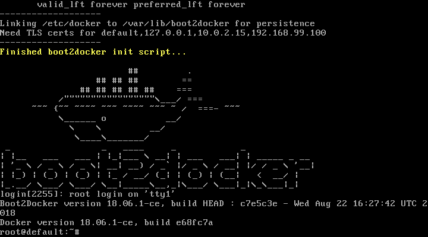

Docker 使用指南
===============

# 安装 Docker Toolbox

- https://download.docker.com/win/stable/DockerToolbox.exe
- https://mirrors.aliyun.com/docker-toolbox/windows/docker-toolbox/DockerToolbox-18.03.0-ce.exe

**测试命令行**

```sh
docker version
docker -h
```


### 配置镜像

L:\Users\Benny\.docker\machine\machines\default\config.json
```json
"RegistryMirror": [
	"https://registry.docker-cn.com"
],
```


# 启动 Docker Quickstart Terminal

```sh
Starting "default"...
(default) Check network to re-create if needed...
(default) Windows might ask for the permission to configure a dhcp server. Somet
imes, such confirmation window is minimized in the taskbar.
(default) Waiting for an IP...
Machine "default" was started.
Waiting for SSH to be available...
Detecting the provisioner...
Started machines may have new IP addresses. You may need to re-run the `docker-m
achine env` command.
Regenerate TLS machine certs?  Warning: this is irreversible. (y/n): Regeneratin
g TLS certificates
Waiting for SSH to be available...
Detecting the provisioner...
Copying certs to the local machine directory...
Copying certs to the remote machine...
Setting Docker configuration on the remote daemon...


                    ##         .
              ## ## ##        ==
           ## ## ## ## ##    ===
       /"""""""""""""""""\___/ ===
  ~~~ {~~ ~~~~ ~~~ ~~~~ ~~~ ~ /  ===- ~~~
       \______ o           __/
         \    \         __/
          \____\_______/


docker is configured to use the default machine with IP 192.168.99.100
For help getting started, check out the docs at https://docs.docker.com


Start interactive shell

Benny@Taurus MINGW64 /l/Program Files/Docker Toolbox
$
```

**查看已有映像**
```sh
docker image ls
```

**拉取映像文件**

```sh
docker pull registry.docker-cn.com/library/nginx:latest
docker pull registry.docker-cn.com/library/php:fpm
docker image pull library/hello-world
```


**创建并启用容器**
```sh
cd /c/Users
mkdir Docker
cd Docker
wget https://github.com/wuding/webot/archive/master.zip
unzip master.zip
cd webot
docker-compose up -d
```

浏览器访问 http://192.168.99.100

**重启虚拟电脑**

```sh
docker-machine restart
```


# 打开 VirtualBox



1. 关闭虚拟电脑 default
2. 配置系统内存大小、处理器数量和运行峰值


# 启动 Kitematic (Alpha)

1. 启动容器
2. 点击 EXEC 命令窗口
3. 找到要映射的目录和文件
4. 复制到本地磁盘
```sh
docker container cp webot_nginx_1:/etc/nginx/nginx.conf /c/Users/Docker/webot/etc/nginx/nginx.conf
```

容器上的目录和文件可以不存在，只要映射的本地有就可以了

靠谱的方式是先不映射目录，按默认配置运行正常了再改

**编写 .dockerignore 和 Dockerfile 文件**

**发布映像**

```sh
docker login
docker image build -t wuding/blog:latest .
dcoker run -d -p 8000:80 wuding/blog:latest
docker image push wuding/blog:latest
```


## 示例

https://github.com/fork-copy/phphub5